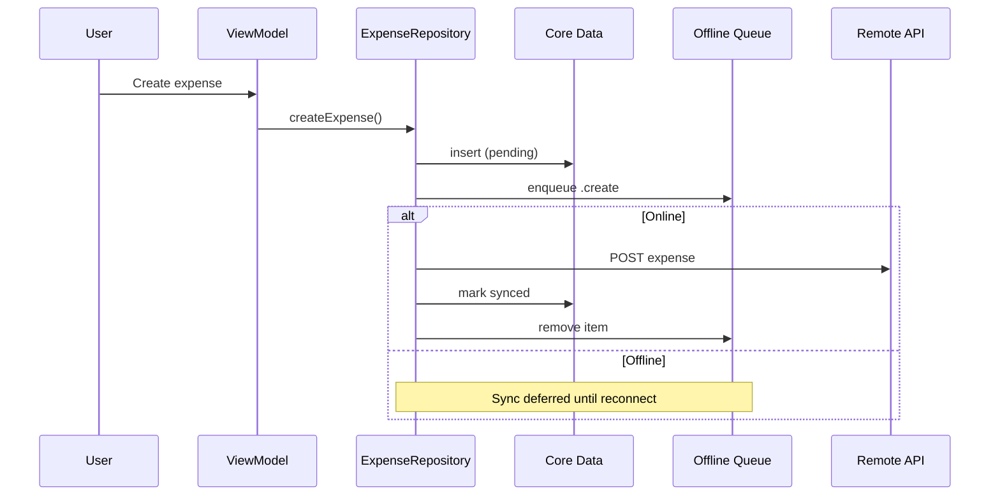

# SmartExpenseManager

A production-oriented iOS expense tracking application built with **Clean Architecture**, **offline-first synchronization**, and **SwiftUI**. SmartExpenseManager lets users create, view, edit, search, and delete expenses with confidence that data is persisted locally first and synchronized reliably when connectivity returns.

---

## Table of Contents

- [Features](#features)
- [Tech Stack](#tech-stack)
- [Architecture](#architecture)
- [Folder Structure](#folder-structure)
- [Offline-First Strategy](#offline-first-strategy)
- [Dependency Injection](#dependency-injection)
- [Networking](#networking)
- [Core Data](#core-data)
- [Testing](#testing)
- [Setup](#setup)
- [Screenshots](#screenshots)
- [Design Decisions](#design-decisions)
- [Assumptions](#assumptions)
- [Future Improvements](#future-improvements)

---

## Features

| Area | Capability |
|------|------------|
| **CRUD** | Create, read, update, and delete expenses |
| **Search** | Debounced search by title and note |
| **Categories** | Food, transport, shopping, entertainment, bills, health, travel, and other |
| **Offline-first** | All writes succeed locally; remote sync is best-effort |
| **Sync status** | Per-expense badges: synced, pending, failed |
| **Auto-sync** | Synchronizes automatically when network reconnects |
| **Background sync** | `BGAppRefreshTask` for deferred synchronization |
| **Conflict resolution** | Local pending changes win; otherwise last-write-wins |
| **Retry failed sync** | Manual retry from list banner and pull-to-refresh |
| **Accessibility** | VoiceOver labels, combined row accessibility, loading hints |
| **Localization-ready** | String catalog (`Localizable.xcstrings`) with `L10n` keys |

---

## Tech Stack

| Layer | Technology |
|-------|------------|
| Language | Swift 6 |
| UI | SwiftUI, `@Observable`, `NavigationStack` |
| Minimum iOS | 17.0 |
| Persistence | Core Data |
| Networking | URLSession, async/await, `NWPathMonitor` |
| Architecture | Clean Architecture + MVVM |
| Modularity | Swift Package Manager (local packages) |
| Logging | `os.log` via `AppLogger` |
| Testing | XCTest, Swift Testing (legacy suites) |
| Background work | `BackgroundTasks` framework |

---

## Architecture

The project follows **Clean Architecture** with strict dependency rules: inner layers never depend on outer layers.

```
┌─────────────────────────────────────────────────────────────┐
│                    SmartExpenseManager (App)                │
│  SwiftUI · ViewModels · Navigation · DI · Background Sync   │
└────────────────────────────┬────────────────────────────────┘
                             │
┌────────────────────────────▼────────────────────────────────┐
│                      Packages / Data                        │
│  Repositories · Use Cases · Core Data · Sync · Remote API    │
└──────────────┬──────────────────────────────┬───────────────┘
               │                              │
┌──────────────▼──────────────┐  ┌───────────▼───────────────┐
│     Packages / Domain       │  │      Packages / Core       │
│  Entities · Protocols       │  │  Network · Extensions ·    │
│  Use Case Contracts         │  │  Utilities · Constants     │
└─────────────────────────────┘  └────────────────────────────┘
```

### Layer Responsibilities

| Layer | Responsibility | Depends On |
|-------|----------------|------------|
| **Presentation** | SwiftUI views, ViewModels, navigation, theming | Domain, Data (via use cases) |
| **Domain** | Business entities, repository/use-case protocols, validation | Nothing |
| **Data** | Repository implementations, Core Data, API, sync engine | Domain, Core |
| **Core** | Shared infrastructure (networking, logging, extensions) | Foundation only |

### Data Flow

```
View → ViewModel → Use Case → Repository → Local Store / Offline Queue / Remote API
```

ViewModels depend on **use case protocols** only — never on networking or Core Data directly.

---

## Folder Structure

```
ExpenseManagement/
├── SmartExpenseManager/                 # iOS app target
│   ├── SmartExpenseManagerApp.swift     # Entry point, lifecycle, sync bootstrap
│   ├── Core/
│   │   ├── DI/                         # AppContainer, ViewModelFactory, @Inject
│   │   ├── Sync/                       # BackgroundSyncScheduler
│   │   └── Localization/               # L10n keys
│   ├── Presentation/
│   │   ├── Components/                 # Reusable SwiftUI components
│   │   ├── Modifiers/                  # loadingOverlay, errorAlert, etc.
│   │   ├── Navigation/                 # AppRouter, AppRoute
│   │   ├── Screens/                    # Feature screens
│   │   ├── Theme/                      # Category colors and icons
│   │   └── ViewModels/                 # @Observable ViewModels + state
│   └── Resources/
│       ├── Assets.xcassets
│       └── Localizable.xcstrings
│
├── SmartExpenseManagerTests/            # Unit tests (XCTest)
│   ├── Mocks/                          # MockExpenseRepository, test doubles
│   ├── Repository/
│   ├── UseCases/
│   ├── ViewModels/
│   ├── Persistence/
│   ├── Networking/
│   └── DI/
│
├── SmartExpenseManagerUITests/          # UI tests
│
└── Packages/
    ├── Core/
    │   └── Sources/Core/
    │       ├── Constants/
    │       ├── Extensions/
    │       ├── Network/                 # APIClient, reachability, retry policy
    │       └── Utilities/               # AppLogger, Debouncer, UserErrorMessage
    │
    ├── Domain/
    │   └── Sources/Domain/
    │       ├── Entities/
    │       ├── Repositories/            # Protocols only
    │       ├── UseCases/                # Protocols only
    │       └── Validation/              # ExpenseFormValidator
    │
    └── Data/
        └── Sources/Data/
            ├── Local/                   # Core Data manager, stores, models
            ├── Remote/                  # API data source, DTOs, endpoints
            ├── Repository/              # ExpenseRepository
            ├── Sync/                    # Offline queue, coordinator, conflict resolver
            ├── Mapper/                  # Entity ↔ domain mapping
            └── UseCases/                # Use case implementations
```

---

## Offline-First Strategy

SmartExpenseManager treats the **local Core Data cache as the source of truth for reads** and persists every write locally before attempting remote synchronization.

### Write Path

1. **Write to Core Data** — insert/update/delete locally immediately
2. **Enqueue operation** — persist create/update/delete in `OfflineQueueEntity`
3. **Attempt sync** — if online, process queue and merge remote data

### Sync Engine

| Component | Role |
|-----------|------|
| `ExpenseOfflineQueue` | Durable pending-operations queue in Core Data |
| `ExpenseRepository.syncExpenses()` | Processes queue, merges remote, resolves conflicts |
| `ExpenseRepository.retryFailedSync()` | Resets retry counts and re-processes failed items |
| `ExpenseSyncCoordinator` | Listens to reachability; auto-syncs on reconnect |
| `BackgroundSyncScheduler` | Registers `BGAppRefreshTask` for background sync |
| `ExpenseConflictResolver` | Pending local wins; otherwise newest `updatedAt` wins |

### Sync Status

Each expense carries an `ExpenseSyncStatus`:

- **Synced** — successfully persisted remotely
- **Pending** — local change awaiting sync
- **Failed** — max retries exceeded; user can retry manually

### Data Safety Guarantees

- Queue items survive sync failures (configurable retry limit, default: 3)
- Orphaned pending records are re-queued on sync
- Remote deletes are **queued before** local removal to prevent data loss
- Never-synced deletes remove local record and queue entry only (no remote call)



---

## Dependency Injection

DI is handled natively — no third-party containers.

| Component | Purpose |
|-----------|---------|
| `AppContainer` | Composition root; wires the full dependency graph |
| `DIContainer` | Protocol defining all resolvable dependencies |
| `DataDependencyFactory` | Constructs repositories, use cases, sync coordinator |
| `NetworkDependencyFactory` | Constructs API client with interceptors |
| `ViewModelFactory` | Creates screen ViewModels from container |
| `@Inject` | Property wrapper + SwiftUI `Environment` for container access |
| `Configuration.testing()` | Pre-configured mocks for unit tests and previews |

```swift
// Production
let container = AppContainer(configuration: .production)

// Testing
let container = AppContainer(configuration: .testing(apiClient: MockAPIClient()))
```

---

## Networking

Built on a lightweight, protocol-oriented stack in the **Core** package.

| Feature | Implementation |
|---------|----------------|
| HTTP client | `APIClient` / `DefaultAPIClient` (URLSession + async/await) |
| Endpoints | Type-safe `Endpoint` protocol with `RequestBuilder` |
| Auth | `BearerTokenInterceptor` |
| Logging | `DefaultNetworkLogger` (redacts sensitive headers) |
| Retry | Configurable `RetryPolicy` for transient server errors |
| Reachability | `NWPathMonitorReachability` with `AsyncStream<Bool>` |
| Errors | Typed `APIError` mapped from HTTP status and URL errors |
| Testing | `MockAPIClient`, `AlwaysConnectedReachability` |

**Base URL:** `https://api.smartexpensemanager.com/v1` (configurable via `APIConstants`)

---

## Core Data

| Entity | Purpose |
|--------|---------|
| `ExpenseEntity` | Cached expense records with sync status |
| `OfflineQueueEntity` | Pending create/update/delete operations |

| Component | Purpose |
|-----------|---------|
| `CoreDataManager` | Generic stack management (no business logic) |
| `ExpenseLocalStore` | CRUD + `fetchPendingSync()` / `fetchFailedSync()` |
| `ExpenseOfflineQueue` | Queue enqueue, dequeue, retry count management |
| `ExpenseEntityMapper` | Maps between Core Data, domain, and DTO models |
| `MockCoreDataManager` | In-memory store for fast unit tests |

Core Data model: `Packages/Data/Sources/Data/Local/SmartExpenseManager.xcdatamodeld`

---

## Testing

The test suite targets **business logic** with fast, isolated unit tests.

### Test Targets

| Target | Focus |
|--------|-------|
| `SmartExpenseManagerTests` | Repository, use cases, ViewModels, DI, networking, persistence |
| `SmartExpenseManagerUITests` | Launch and navigation smoke tests |

### Coverage Highlights

| Layer | What's Tested |
|-------|---------------|
| **Repository** | CRUD, offline reads, sync/retry, conflict resolution, auto-sync on reconnect |
| **Use Cases** | Success and failure paths via `MockExpenseRepository` |
| **ViewModels** | Screen states, search, sync counts, form validation, delete flows |
| **Networking** | Request building, interceptors, retry policy, error mapping |
| **Persistence** | Insert, fetch, upsert, delete, pending sync queries |

### Running Tests

```bash
# From project root
xcodebuild \
  -project SmartExpenseManager.xcodeproj \
  -scheme SmartExpenseManager \
  -destination 'platform=iOS Simulator,name=iPhone 17' \
  -only-testing:SmartExpenseManagerTests \
  test
```

Or in Xcode: **Product → Test** (`⌘U`).

---

## Setup

### Requirements

- macOS with **Xcode 16+**
- iOS **17.0+** simulator or device
- Swift **6.0**

### Clone and Run

```bash
git clone <repository-url>
cd ExpenseManagement
open SmartExpenseManager.xcodeproj
```

1. Select the **SmartExpenseManager** scheme
2. Choose an iOS 17+ simulator
3. Press **Run** (`⌘R`)

### Configuration

| Setting | Location | Default |
|---------|----------|---------|
| API base URL | `Packages/Core/.../APIConstants.swift` | `https://api.smartexpensemanager.com/v1` |
| Sync retries | `ExpenseRepositoryConfiguration.maxSyncRetries` | `3` |
| Auto-sync on reconnect | `ExpenseRepositoryConfiguration.autoSyncOnReconnect` | `true` |
| Background task ID | `BackgroundSyncScheduler.taskIdentifier` | `com.smartexpensemanager.app.expense-sync` |

> **Note:** Background sync requires the permitted identifier in the app Info.plist (`BGTaskSchedulerPermittedIdentifiers`), which is already configured in the Xcode project.

---

## Screenshots

> Placeholder — add screenshots after running the app on a simulator or device.

| Screen | Preview |
|--------|---------|
| Expense List | _TODO: `Docs/screenshots/list.png`_ |
| Add Expense | _TODO: `Docs/screenshots/add.png`_ |
| Expense Detail | _TODO: `Docs/screenshots/detail.png`_ |
| Sync Banner | _TODO: `Docs/screenshots/sync-banner.png`_ |
| Offline / Pending | _TODO: `Docs/screenshots/pending-badge.png`_ |

Recommended capture sizes: iPhone 15 Pro (6.1") and iPhone 15 Pro Max (6.7").

---

## Design Decisions

| Decision | Rationale |
|----------|-----------|
| **Clean Architecture with SPM modules** | Enforces dependency boundaries; Domain is testable without UI or Core Data |
| **Protocol-oriented use cases** | ViewModels depend on abstractions; easy to mock in tests |
| **Local-first writes** | Users never lose data due to network failures |
| **Queue-based sync** | Operations are durable, ordered, and retryable |
| **Native DI (no Swinject)** | Explicit composition root; no runtime reflection; Swift 6 friendly |
| **`@Observable` ViewModels** | Modern observation without Combine boilerplate |
| **Separate sync coordinator** | Single responsibility: reachability → trigger sync |
| **Conflict resolver as pure functions** | Deterministic, unit-testable merge logic |
| **String catalog localization** | Apple-recommended iOS 17+ approach; supports pluralization |
| **XCTest for primary tests** | Standard iOS CI integration; mock repository pattern |

---

## Assumptions

| Assumption | Detail |
|------------|--------|
| REST API availability | Backend exposes standard CRUD endpoints for expenses |
| Single user, single device | No multi-account or cross-device conflict handling beyond merge rules |
| Server timestamps | Remote `updatedAt` is authoritative when local record is synced |
| iOS 17 minimum | Enables `@Observable`, String catalogs, and modern SwiftUI APIs |
| USD default currency | Configurable via `AppConstants.defaultCurrencyCode` |
| No authentication UI | Bearer token interceptor exists; token provisioning is out of scope |
| Mock-friendly backend | API contract matches `ExpenseDTO` shape in the Data layer |

---

## Future Improvements

- [ ] **Authentication flow** — login, token refresh, secure keychain storage
- [ ] **Push notifications** — silent push to trigger sync
- [ ] **Widgets & Live Activities** — spending summary on Home Screen
- [ ] **Charts & analytics** — category breakdown, monthly trends
- [ ] **Receipt scanning** — OCR for automatic expense entry
- [ ] **Multi-currency support** — per-expense currency with exchange rates
- [ ] **iCloud / CloudKit sync** — alternative or complement to REST sync
- [ ] **Soft-delete tombstones** — retain deleted records until remote confirmation
- [ ] **Snapshot & UI tests** — visual regression and full navigation coverage
- [ ] **CI/CD pipeline** — GitHub Actions with build, test, and TestFlight deploy
- [ ] **Additional locales** — translate `Localizable.xcstrings` beyond English

---

## License

This project was developed as a hiring assessment sample. Add a license file before public distribution.

---

## Contact

For questions about architecture or implementation details, open an issue or contact the maintainer.
